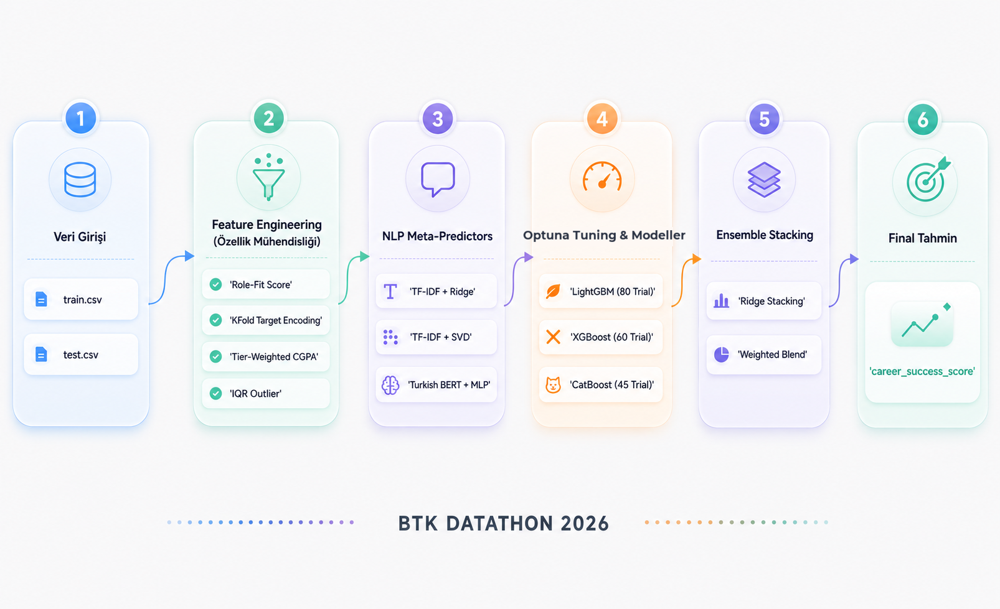

# BTK Datathon 2026 - Student Career Success Prediction 🚀


This repository contains the end-to-end data science pipeline developed for the **BTK Datathon 2026**. The goal of the project is to predict a student's `career_success_score` based on their technical skills, soft skills, demographic information, and textual mentor feedback.

## 🌟 Project Architecture

Below is the complete pipeline architecture from data ingestion to final ensemble stacking:



## 🛠️ Technical Implementation

### 1. Feature Engineering
- **Role-Fit Score:** A custom metric heavily weighting specific technical skills based on the candidate's `target_role` (e.g., Data Scientist vs. Backend Developer).
- **KFold Target Encoding:** Applied to categorical features to extract deep relationships without data leakage.
- **Tier-Weighted CGPA:** University CGPA normalized by university tier metrics.
- **IQR Outlier Management:** Robust detection and handling of extreme outliers.

### 2. NLP Meta-Predictors
Mentor feedback text is a crucial signal for predicting soft skills and culture fit. We processed the `mentor_feedback_text` using:
- **TF-IDF + Ridge Regression:** A fast OOF linear meta-predictor.
- **TF-IDF + SVD:** Dimensionality reduction to 30 dense features.
- **Turkish BERT (`dbmdz/bert-base-turkish-128k-uncased`):** Extracted 768-dimensional embeddings, passed through a Multi-Layer Perceptron (MLPRegressor) to generate a powerful deep-learning meta-feature.

### 3. Optuna Hyperparameter Tuning
Extensive hyperparameter optimization using `Optuna` with 5-Fold Cross Validation:
- **LightGBM:** 80 Trials
- **XGBoost:** 60 Trials
- **CatBoost:** 45 Trials

### 4. Ensemble Stacking & Blending
To maximize predictive stability and lower Mean Squared Error (MSE), the final predictions are aggregated using:
- **Ridge Stacking:** A meta-learner that takes the Out-Of-Fold (OOF) predictions of LGB, XGB, CAT, and NLP models as input.
- **Weighted Blending:** A manually optimized weighted average of the top models.

## 🚀 How to Run

1. Clone the repository:
```bash
git clone https://github.com/AhmetCannnn/btk_datathon_2026.git
cd btk_datathon_2026
```

2. Install dependencies:
```bash
pip install -r requirements.txt
```

3. Run the solution:
Execute the Jupyter Notebook `BTK_Datathon_2026_Final_Solution.ipynb` cell by cell. Ensure that the Kaggle dataset is located in the appropriate `/kaggle/input/` or local `DATA_DIR` directory.

## 📊 Final Submission
The final output is generated as `submission4.csv` and contains the predicted `career_success_score` bounded strictly between 0 and 100.
